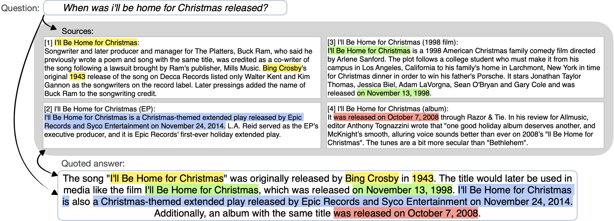

# QuoteSum
QuoteSum is a textual QA dataset containing Semi-Extractive Multi-source Question Answering (SEMQA) examples written by humans, based on Wikipedia passages.

The dataset is described in detail in the paper: [SEMQA: Semi-Extractive Multi-Source Question Answering](https://arxiv.org/abs/2311.04886) (NAACL 2024).

## Repository description

The Quotesum dataset is provided in jsonl format in `v1` dir.

The string-based metrics for comparing generated outputs with human-writtern references are provided in the `evals` dir with an example notebook. 

## Semi-Extractive Multi-source Question Answering (SEMQA)

In SEMQA, the answer combines information from multiple sources while explicitly extracting factual spans, and connecting them into a coherent well-grounded passage. See the paper for more details.

